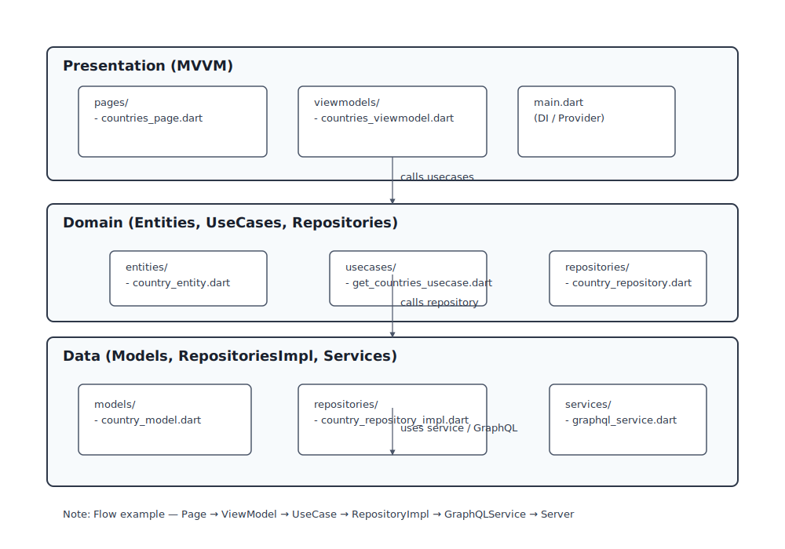

# Flutter GraphQL Demo

This repository is a small Flutter demo that shows how to structure a Flutter app using Clean Architecture and the MVVM pattern while fetching data from a GraphQL server using `graphql_flutter`.

## Project purpose

The app demonstrates a simple, testable, and maintainable architecture for Flutter apps. It fetches country data from a GraphQL endpoint (via a `GraphQLService`) and exposes it to the UI using a `ViewModel` (MVVM). The domain layer defines use cases and entities, and the data layer contains models, repositories and service implementations.

## Tools and dependencies

- Flutter SDK (Dart >= 3.9.2 as set in `pubspec.yaml` environment)
- graphql_flutter: ^5.2.1 — GraphQL client for Flutter for making queries and handling cache
- provider: ^6.1.5+1 — Simple state management used to provide the viewmodel to the widget tree
- flutter_lints: ^5.0.0 — Lint rules for a consistent code style

These dependencies are declared in `pubspec.yaml`.

## Architecture overview

This project follows Clean Architecture boundaries and MVVM for presentation:

- Presentation (MVVM)
  - `presentation/pages` — Flutter widgets (UI pages)
  - `presentation/viewmodels` — ViewModels that expose observable state to the UI and call use cases

- Domain (pure business rules)
  - `domain/entities` — Plain entities used through the domain layer
  - `domain/repositories` — Repository interfaces (abstractions) used by use cases
  - `domain/usecases` — Use case classes (application-specific business rules)

- Data (framework & drivers)
  - `data/models` — DTOs / data models used to parse GraphQL responses and map to entities
  - `data/repositories` — Repository implementations that talk to services and map models to entities
  - `data/services` — Low-level services (e.g., `GraphQLService`) that communicate with external systems

This separation keeps UI, business logic, and data access independent, improving testability and maintainability.

## MVVM mapping

- Model: Entities & Models found in `domain/entities` and `data/models`.
- ViewModel: `presentation/viewmodels/countries_viewmodel.dart` — exposes state and commands for the UI.
- View: `presentation/pages/countries_page.dart` — listens to the ViewModel (provided via `provider`) and renders UI.

The ViewModel calls a use case from the domain layer (for example `GetCountriesUsecase`) which in turn talks to a repository interface. The repository interface is implemented in `data/repositories/country_repository_impl.dart` which uses `GraphQLService` to fetch raw data.

## GraphQL usage

- `graphql_flutter` is used to execute GraphQL queries against a server. The low-level logic lives in `data/services/graphql_service.dart` which sets up the GraphQL client and provides methods to run queries and return raw JSON results or parsed models.
- The repository (`CountryRepositoryImpl`) uses `GraphQLService` to send a query, then maps the JSON result to `CountryModel` instances and converts them into domain `CountryEntity` objects.

Typical flow:

1. `CountriesPage` requests data (for example, on init).
2. The `CountriesViewModel` calls `GetCountriesUsecase`.
3. `GetCountriesUsecase` calls the `CountryRepository` interface.
4. `CountryRepositoryImpl` (data layer) uses `GraphQLService` to run the GraphQL query.
5. `GraphQLService` returns response JSON which `CountryRepositoryImpl` maps into `CountryModel`.
6. Models are converted to `CountryEntity` and returned up the stack to the ViewModel.
7. ViewModel updates observable state; the UI rebuilds.

## Project structure (key files)

- `lib/main.dart` — app entrypoint and DI / provider wiring (where `CountriesViewModel` is provided to the widget tree)
- `lib/presentation/pages/countries_page.dart` — UI page that displays the list of countries
- `lib/presentation/viewmodels/countries_viewmodel.dart` — ViewModel exposing state for the countries page
- `lib/domain/entities/country_entity.dart` — domain entity representing a country
- `lib/domain/usecases/get_countries_usecase.dart` — use case to fetch countries
- `lib/data/services/graphql_service.dart` — GraphQL client wrapper
- `lib/data/repositories/country_repository_impl.dart` — implementation of `CountryRepository` (maps models to entities)
- `lib/data/models/country_model.dart` — data model / DTO for country JSON response

Explore these files to see concrete implementations and mapping functions.

## Architecture diagram

Below is a UML-style diagram showing the main layers (Presentation, Domain, Data) and the main files that live in each layer. It illustrates the typical call flow used in this project.



## How to run

1. Ensure Flutter is installed and set up (see flutter.dev). The project targets Flutter with Dart SDK constraint ^3.9.2.
2. From project root, get packages:

```bash
flutter pub get
```

3. Run the app (choose a device or simulator):

```bash
flutter run
```

If you need to run on a specific platform (iOS/Android/web), use `-d` with the appropriate device id.

## Notes and assumptions

- The repo contains the necessary wiring for the app, but a real GraphQL endpoint URL and any necessary authentication details must be configured inside `GraphQLService`.
- Error handling, loading states, and caching are recommended additions if not fully implemented already. Consider using `graphql_flutter`'s cache strategies and proper ViewModel state enums (loading, success, error).

## Next steps / improvements

- Add unit tests for use cases and repositories.
- Add widget tests for the `CountriesPage` using mocked ViewModels.
- Improve DI (use `get_it` or similar) for easier testing and decoupling.
- Add environment configuration for GraphQL endpoint and auth (secrets management).

## Testing

This project includes unit tests for the presentation/viewmodel layer located under `test/presentation/viewmodels`. The test suite uses the following tools:

- `flutter_test` — the default Flutter test framework (already included via `dev_dependencies`).
- `mockito` — for generating and using mocks of repository/service interfaces.
- `build_runner` — to generate Mockito mock classes (the generated files live under `test/mocks`).

What was added in `test/`:

- `test/presentation/viewmodels/countries_view_model_test.dart` — tests for the `CountriesViewModel` behavior.
- `test/mocks/mocks.dart` and generated `test/mocks/mocks.mocks.dart` — mock interfaces and generated mock implementations used by the tests.

How the tests work (high level):

1. The `CountriesViewModel` is tested in isolation. Dependencies such as the `CountryRepository` are replaced by Mockito-generated mock implementations.
2. Tests arrange (set up) mock responses from the repository/service, exercise the ViewModel (for example by calling a `load()` method), and assert expected ViewModel state transitions (loading → success/error) and data mapping.

How to run tests and generate mocks

1. Get packages (if you haven't already):

```bash
flutter pub get
```

2. Generate mock files (run this whenever you update mock annotations):

```bash
flutter pub run build_runner build --delete-conflicting-outputs
```

This will produce the `test/mocks/mocks.mocks.dart` file that the tests import.

3. Run the test suite:

```bash
flutter test
```

Tips and notes

- Keep mocks small: mock only the methods you need for each test to avoid brittle tests.
- If you prefer faster iteration, run a single test file with `flutter test test/presentation/viewmodels/countries_view_model_test.dart`.
- Use `--coverage` or test reporters if you want coverage reports or CI integration.
